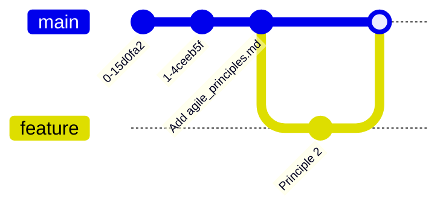
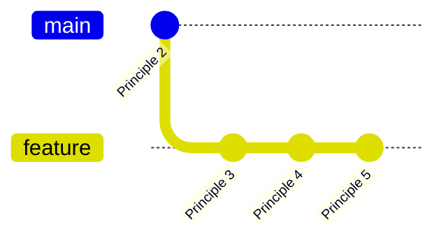
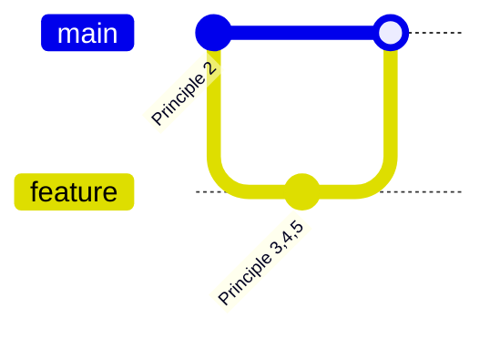
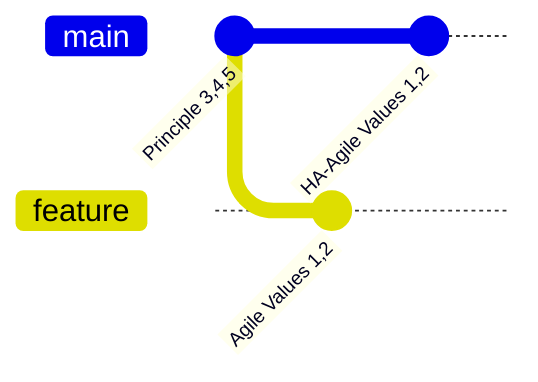
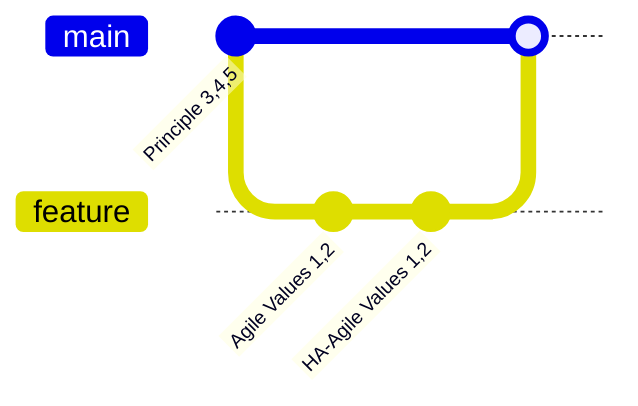

# bbv Embedded Bootcamp: Git

## Preparations before the Course

### Software to install

- git
- bash-like terminal
  - in WSL, or real Linux
- 3-way-diff-capable editor
  - VS Code, Meld, ...
- cli editor: e.g. vim, nano, emacs

### Configurations
- It is useful to be able to do things in a CLI editor. For example when renaming commits or rebasing.
  - choose your CLI editor with `git config --global core.editor <your_favourite_cli_editor>`
  - editors could be vim, nano, emacs. nano has a gentle learning curve.
- After `git config --global <something>` there should be now a file `~/.gitconfig`
  - this is the file where your configurations and tweaks go
  - add your name
  ```
  [user]
  email = <firstname>.<lastname>@bbv.ch
  name = <Firstname> <Lastname>
  ```


## Clone

Without Account: `git clone git://github.com/quattervals/csc.git`
Instead of the "normal" `git@github.com:quattervals/csc.git`


## Messing with Docker
docker run -it --net=host --env="DISPLAY" --volume="$HOME/.Xauthority:/root/.Xauthority:rw" vsc-aoc22-068b3058255ca45b4e0ab5efa08e9ec452f95af6ef36afba2cb2c1e4aef0c798-uid /bin/bash

## Helpful commands

- what have I done so far in a nice and tidy view: `git log --graph --oneline --all --decorate`
- whats currently going on? `git status`
- what are my changes w.r.t. `HEAD`? `git diff`
- repo overview with git graph
- who has done that mess? `git blame <filename>`
  - decent IDEs show bleme info when hovering over a line

## Resources
- [Agile Manifesto: Values](https://agilemanifesto.org/)
- [Agile Manifesto: Principles](https://agilemanifesto.org/principles.html)
- [Agile Manifesto: Values found in practice](https://www.halfarsedagilemanifesto.org/)


In the end, we should have two files in src with the following content.
We'll get there step by step.

File `src/agile_values.md`

```md
# Agile Values

Manifesto for Agile Software Development

## Preamble
We are uncovering better ways of developing
software by doing it and helping others do it.
Through this work we have come to value:

## Values
1. Individuals and interactions over processes and tools
2. Working software over comprehensive documentation
3. Customer collaboration over contract negotiation
4. Responding to change over following a plan

## Coda
That is, while there is value in the items on
the right, we value the items on the left more.
```

In reality, we see these values sometimes
```md
# Half-Arsed Agile Values

Manifesto for Half-Arsed Agile Software Development

## Preamble
We have heard about new ways of developing software by
paying consultants and reading Gartner reports. Through
this we have been told to value:

## Values

1. Individuals and interactions over processes and tools
   and we have mandatory processes and tools to control how those
   individuals (we prefer the term ‘resources’) interact

2. Working software over comprehensive documentation
   as long as that software is comprehensively documented

3. Customer collaboration over contract negotiation
   within the boundaries of strict contracts, of course,
   and subject to rigorous change control

4. Responding to change over following a plan
   provided a detailed plan is in place to respond to the change,
   and it is followed precisely

## Coda

That is, while the items on the left sound nice
in theory, we’re an enterprise company, and there’s
no way we’re letting go of the items on the right.

```

File `src/agile_principles.md`

```md
# Agile Principles

We follow these principles:

1. Our highest priority is to satisfy the customer
through early and continuous delivery
of valuable software.

2. Welcome changing requirements, even late in
development. Agile processes harness change for
the customer's competitive advantage.

3. Deliver working software frequently, from a
couple of weeks to a couple of months, with a
preference to the shorter timescale.

4. Business people and developers must work
together daily throughout the project.

5. Build projects around motivated individuals.
Give them the environment and support they need,
and trust them to get the job done.

6. The most efficient and effective method of
conveying information to and within a development
team is face-to-face conversation.

7. Working software is the primary measure of progress.

8. Agile processes promote sustainable development.
The sponsors, developers, and users should be able
to maintain a constant pace indefinitely.

9. Continuous attention to technical excellence
and good design enhances agility.

10. Simplicity--the art of maximizing the amount
of work not done--is essential.

11. The best architectures, requirements, and designs
emerge from self-organizing teams.

12. At regular intervals, the team reflects on how
to become more effective, then tunes and adjusts
its behavior accordingly.
```

## Tasks

### Clone the remote repo

- clone
- look at the history


### Simple Workflow

Absolute minimal workflow


We add to `agile_principles.md`
- create a branch `feature`
- add title ,  commit
- add principle 1, commit
- merge to `main`

The goal is to achieve a history like this:


### Rebasing

Keep your feature branch up to date with the main.

We add to `agile_principles.md`
- create a branch `feature`
- add principle 2, commit
- switch to branch `main`
- add file `agile_values.md` with just the title, commit
- switch to branch `feature`
- rebase `feature` onto `main`
- merge back to `main`

This is how your history looks before the rebase


This is how your history looks after the rebase.
After the rebase, `feature` has the same history as the main branch plus the `feature` development on top



Rebasing before merging lets us have feature branches which are short. The pros are:
- the history of `main` looks tidy
- your feature is based on up to date `main` not on some ancient `main`
- possible conflicts are resolved when rebasing, not when merging to `main`


### Squash/Fixup

While developing, it is beneficial to commit often.
But you also might want to tidy things up. For example principle 3..5 belong together.
In hindsight, we prefer to add them as one commit. This is where squash/fixup comes in handy.

We add to `agile_principles.md`
- create a branch `feature`
- add principle 3 commit
- add principle 4 commit
- add principle 5 commit
- how does the history look?
- squash/fixup to one commit
  - your tool is `git rebase -i HEAD~<n>`
  - new commit message is `add principle 2,3,4`
- how does the history look now?
  - notice the hashes have changed
- merge to `main`

History before the fixup



History after the fixup and merge back to `main`



### Resolve conflicts

In most professional projects you don't work alone. Many developers work and commit their changes in parallel. Often, git can resolve such situations. But sometimes this leads to a conflict, which can't be resolved automatically. In this situation, you as a developer have to resolve conflicts manually.
Let's simulate such a situation. While you develop on `feature`, some incompatible changes make it to `main`

We add the real agile values to `agile_values.md`
- create a branch `feature`
- add preamble plus values 1 and 2, commit
-
Simulate change on `main`
- switch to `main`
- add preamble plus values 1 and 2 of the _half-arsed values_, commit

So that the history looks like this


In order to merge back to `main`, you attempt to rebase on `main`.
Git tells us that there is a conflict:

```
Auto-merging src/agile_values.md
CONFLICT (content): Merge conflict in src/agile_values.md
error: could not apply b00c724... correct agile values
hint: Resolve all conflicts manually, mark them as resolved with
hint: "git add/rm <conflicted_files>", then run "git rebase --continue".
hint: You can instead skip this commit: run "git rebase --skip".
hint: To abort and get back to the state before "git rebase", run "git rebase --abort".
Recorded preimage for 'src/agile_values.md'
Could not apply b00c724... correct agile values
```

At this point, in the file with the conflicts, we find markers like `<<<<<<<`, `||||||| parent of b00c724 (correct agile values)`, `=======`, etc. The markers tell us where the two variants separated in the git history and how each variant adds changes to the common ancestor. The markers are a bit hard to read, so most IDEs or stand-alone tools provide some ways to achieve a three way merge.

| Local/`main`/current |         Result         | Remote/`feature`/incoming |
| :------------------- | :--------------------: | ------------------------: |
| Code as in `main`    | The resolved conflicts |      Code as in `feature` |

The tools let you pick from Local, from Remote or write something new into the center column.
Since the code in `feature` is the better choice, we can pick all of the code in `feature`.

If unclear what to do now: `git status` gives often good hints.

Finish the rebase and merge back to `main` so that the history looks like this


BTW: if you run into a situation where there is a risk of losing your changes, just make a backup of your branch: Assuming you are on `feature`, do
- `git rebase --abort` to stop the process
- `git branch feature_backup`
- retry your operation

### Push some branch to remote

### merge on remote

### rebase, merge conflict
