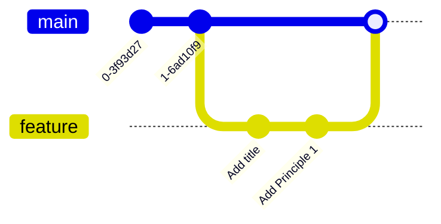
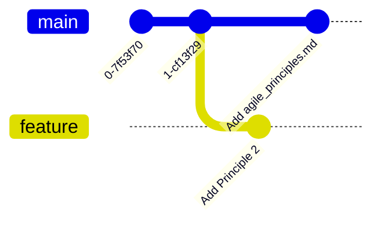
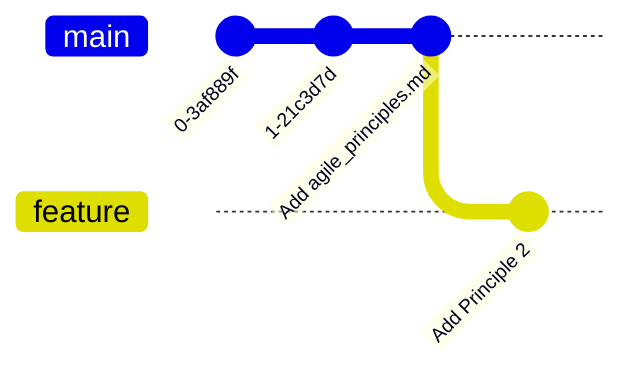
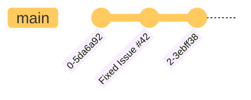

# bbv Embedded Bootcamp: Git

## Preparations before the Course

### Software to install

- git
- bash-like terminal
  - in WSL, or real Linux
- 3-way-diff-capable editor
  - VS Code, Meld, ...
- cli editor: e.g. vim, nano, emacs

### Configurations
- It is useful to be able to do things in a CLI editor. For example when renaming commits or rebasing.
  - choose your CLI editor with `git config --global core.editor <your_favourite_cli_editor>`
  - editors could be vim, nano, emacs. nano has a gentle learning curve.
- After `git config --global <something>` there should be now a file `~/.gitconfig`
  - this is the file where your configurations and tweaks go
  - add your name
  ```
  [user]
  email = <firstname>.<lastname>@bbv.ch
  name = <Firstname> <Lastname>
  ```


## Clone

Without Account: `git clone git://github.com/quattervals/csc.git`
Instead of the "normal" `git@github.com:quattervals/csc.git`


## Messing with Docker
docker run -it --net=host --env="DISPLAY" --volume="$HOME/.Xauthority:/root/.Xauthority:rw" vsc-aoc22-068b3058255ca45b4e0ab5efa08e9ec452f95af6ef36afba2cb2c1e4aef0c798-uid /bin/bash

## Helpful commands

- what have I done so far in a nice and tidy view: `git log --graph --oneline --all --decorate`
- whats currently going on? `git status`
- what are my changes w.r.t. `HEAD`? `git diff`
-

## Resources
- [Agile Manifesto: Values](https://agilemanifesto.org/)
- [Agile Manifesto: Principles](https://agilemanifesto.org/principles.html)
- [Agile Manifesto: the practical values](https://www.halfarsedagilemanifesto.org/)


In the end, we should have two files in src with the following content.
We'll get there step by step.

File `src/agile_values.md`

```md
# Agile Values

Manifesto for Agile Software Development

## Preamble
We are uncovering better ways of developing
software by doing it and helping others do it.
Through this work we have come to value:

## Values
1. Individuals and interactions over processes and tools
2. Working software over comprehensive documentation
3. Customer collaboration over contract negotiation
4. Responding to change over following a plan

## Coda
That is, while there is value in the items on
the right, we value the items on the left more.
```

File `src/agile_principles.md`

```md
# Agile Principles

We follow these principles:

1. Our highest priority is to satisfy the customer
through early and continuous delivery
of valuable software.

2. Welcome changing requirements, even late in
development. Agile processes harness change for
the customer's competitive advantage.

3. Deliver working software frequently, from a
couple of weeks to a couple of months, with a
preference to the shorter timescale.

4. Business people and developers must work
together daily throughout the project.

5. Build projects around motivated individuals.
Give them the environment and support they need,
and trust them to get the job done.

6. The most efficient and effective method of
conveying information to and within a development
team is face-to-face conversation.

7. Working software is the primary measure of progress.

8. Agile processes promote sustainable development.
The sponsors, developers, and users should be able
to maintain a constant pace indefinitely.

9. Continuous attention to technical excellence
and good design enhances agility.

10. Simplicity--the art of maximizing the amount
of work not done--is essential.

11. The best architectures, requirements, and designs
emerge from self-organizing teams.

12. At regular intervals, the team reflects on how
to become more effective, then tunes and adjusts
its behavior accordingly.
```

## Tasks

### Clone the remote repo

- clone
- look at the history


### Branch out, make changes, commit, merge back

Absolute minimal workflow


We add to `agile_principles.md`
- create a branch feature
- add title ,  commit
- add principle 1, commit
- merge to `main`

The goal is to achieve a history like this:


### Branch out, make changes, commit, rebase onto `main`

Keep your feature branch up to date with the main.

We add to `agile_principles.md`
- create a branch feature
- add principle 2, commit
- switch to branch `main`
- add file `agile_principles.md`, commit
- switch to branch feature
- rebase feature onto `main`

This is how your history looks before the rebase


This is how your history looks after the rebase.
After the rebase, `feature` has the same history as the main branch plus the `feature` development on top



### Branch out, make changes, commit, squash, merge back

While developing, it is beneficial to commit often.
But you also might want to tidy things up. For example principle 3..5 belong together.
In hindsight, we prefer to add them as one commit. This is where squash/fixup comes in handy.

We add to `agile_principles.md`
- create a branch feature
- add principle 3 commit
- add principle 4 commit
- add principle 5 commit
- how does the history look?
- squash/fixup to one commit
  - your tool is `git rebase -i HEAD~<n>`
  - new commit message is `add principle 2,3,4`
- how does the history look now?
  - notice the hashes have changed
- merge to `main`


### Push some branch to remote

### merge on remote

### rebase, merge conflic

This is a regular paragraph.


This is another regular paragraph.





